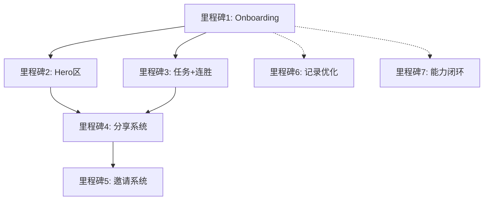

# 前端改造开发路线图

> 基于三个需求文档的深度分析，制定3-4周的系统化开发计划
>
> **文档版本**: v1.0
> **创建日期**: 2025-11-26
> **预计工期**: 16-21天（3-4周）

---

## 📋 执行摘要

### 核心问题（优先级排序）

| 优先级 | 问题 | 影响 | 解决方案里程碑 |
|--------|------|------|----------------|
| **P0** | 新手引导缺失 | 新用户不知从哪开始，流失率高 | 里程碑1 |
| **P0** | 首屏价值不清 | 3秒内无法理解产品价值 | 里程碑2 |
| **P0** | 日常回访动力弱 | 缺少连胜提醒和日常任务 | 里程碑3 |
| **P1** | 社交激励缺失 | 用户孤独训练，缺乏竞争 | 里程碑4、5 |
| **P1** | 训练记录体验差 | 表单摩擦高，错填不可改 | 里程碑6 |
| **P2** | 学习闭环不完整 | 数据不指向行动 | 里程碑7 |

### 已完成工作（2025-11-26）
- ✅ Onboarding.tsx基础框架（4个水平测试问题）
- ✅ App.tsx路由集成
- ✅ useAuth、useNinetyDayTraining hooks优化

### 开发策略
- **第1周（P0）**: 完成里程碑1-3，解决核心留存问题
- **第2周（P1）**: 完成里程碑4-5，增加社交增长功能
- **第3周（P2+测试）**: 完成里程碑6-7，体验优化和全面测试

---

## 🎯 里程碑详细规划

## 里程碑1：Onboarding完整流程（P0）

**目标**: 新用户在首次登录后，完成"理解价值 → 水平测试 → 获取计划 → 开始训练"的完整引导。

**工期**: 3-4天

### 1.1 欢迎页组件（WelcomePage）

**前端任务**:
- [ ] 创建`WelcomePage.tsx`组件
- [ ] 实现三段式痛点共鸣文案
  - "学了一段时间也不知道自己有没有进步？"
  - "不知道该练什么，只会乱打？"
  - "找不到系统课程或靠谱教练？"
- [ ] 添加品牌价值承诺："用90天，从新手到一杆清台"
- [ ] 实现"开始水平测试"CTA按钮
- [ ] 添加页面切换动画（fade transition）

**技术细节**:
```typescript
// WelcomePage.tsx 结构
<Card className="max-w-2xl mx-auto">
  <CardHeader>
    <Logo />
    <h1>欢迎来到三个月一杆清台训练系统</h1>
  </CardHeader>
  <CardContent>
    <PainPointsSection /> {/* 三段痛点 */}
    <ValueProposition /> {/* 价值承诺 */}
    <Button onClick={handleStart}>开始水平测试</Button>
  </CardContent>
</Card>
```

### 1.2 水平测试页面优化（QuestionPage）

**前端任务**:
- [ ] 为每个问题选项添加hint提示
- [ ] 添加进度指示器（"第X/4题"）
- [ ] 优化选项按钮的hover/selected状态
- [ ] 添加返回上一题功能
- [ ] 实现答案存储到state

**优化示例**:
```typescript
// 每个选项增加hint
options: [
  {
    label: "几乎不能",
    score: 0,
    hint: "需要从基础瞄准和出杆开始"
  },
  {
    label: "偶尔可以",
    score: 1,
    hint: "有感觉但不稳定"
  },
]
```

### 1.3 结果页组件（ResultPage）

**前端任务**:
- [ ] 创建`ResultPage.tsx`组件
- [ ] 实现"正在生成专属计划..."加载动画
- [ ] 显示推荐起始天数（基于计分算法）
- [ ] 显示初始能力预估（5维雷达图）
- [ ] 创建`ThreeDayPlanCard`组件（可复用）
  - 展示Day1-3的训练主题、预计用时
  - "开始第X天训练"按钮
- [ ] 调用后端API保存引导结果

**计分算法**:
```typescript
// computeRecommendedStart已实现
function computeRecommendedStart(answers: AnswerMap) {
  const totalScore = QUESTIONS.reduce((sum, q) => {
    const choice = answers[q.id];
    return sum + choice * q.weight;
  }, 0);

  if (totalScore <= 2) return 1;    // 完全新手
  if (totalScore <= 4) return 5;    // 有点基础
  if (totalScore <= 6) return 10;   // 中等水平
  return 15;                         // 有经验
}
```

### 1.4 路由强制跳转逻辑

**前端任务**:
- [ ] 修改`App.tsx`的`AppContent`函数
- [ ] 添加引导完成状态检查
  ```typescript
  useEffect(() => {
    if (isAuthenticated && user && !user.onboardingCompleted) {
      navigate('/onboarding');
    }
  }, [isAuthenticated, user]);
  ```
- [ ] 实现双保险机制：
  - localStorage: `onboarding_completed`
  - 后端字段: `users.onboarding_completed`
- [ ] 修改首次登录落地页为`/ninety-day-challenge`

### 1.5 后端支持

**后端任务**:
- [ ] 新增API: `POST /api/onboarding/complete`
  ```typescript
  // Request body
  {
    startDay: number,           // 推荐起始天数
    initialScores: {            // 初始能力分
      accuracy: number,
      positioning: number,
      // ...
    },
    answers: AnswerMap          // 测试答案
  }
  ```
- [ ] 更新数据库schema（`shared/schema.ts`）
  ```typescript
  // users表新增字段
  onboardingCompleted: boolean().default(false),
  recommendedStartDay: integer(),
  onboardingAnswers: jsonb(),
  ```
- [ ] 运行`npm run db:push`同步schema
- [ ] 实现API handler（`server/routes.ts`）

**预计工时**:
- 前端：2.5天
- 后端：1天
- 联调测试：0.5天

---

## 里程碑2：挑战页Hero区重构（P0）

**目标**: 3秒内传达价值，10秒内看到行动路径。

**工期**: 2-3天

### 2.1 文案重构

**前端任务**:
- [ ] 修改`NinetyDayChallenge.tsx`的Header组件
- [ ] 主标题："用90天，从新手到一杆清台"
- [ ] 副标题："每天30分钟，已有1000+新手完成清台"
- [ ] 主按钮：改为动态显示"开始我的第X天训练"
  ```typescript
  const currentDay = challengeProgress?.currentDay || 1;
  <Button>开始我的第{currentDay}天训练</Button>
  ```

### 2.2 里程碑进度条组件

**前端任务**:
- [ ] 创建`MilestoneProgressBar.tsx`组件
- [ ] 实现三段式进度条
  - 基础阶段（1-30天）：浅绿色
  - 进阶阶段（31-60天）：中绿色
  - 实战阶段（61-90天）：深绿色
- [ ] 显示当前阶段和剩余天数
- [ ] 使用shadcn/ui的`Progress`组件

**实现示例**:
```typescript
<MilestoneProgressBar
  currentDay={challengeProgress?.currentDay || 1}
  totalDays={90}
  milestones={[
    { name: "基础", range: [1, 30], color: "emerald-200" },
    { name: "进阶", range: [31, 60], color: "emerald-400" },
    { name: "实战", range: [61, 90], color: "emerald-600" },
  ]}
/>
```

### 2.3 真实背景图

**前端任务**:
- [ ] 准备台球场景高清图（1920x1080）
- [ ] 实现CSS背景图片 + 半透明overlay
  ```css
  .hero-section {
    background-image: linear-gradient(rgba(0,0,0,0.4), rgba(0,0,0,0.4)),
                      url('/assets/billiard-scene.jpg');
    background-size: cover;
    background-position: center;
  }
  ```
- [ ] 优化移动端显示（background-position调整）

### 2.4 "如何开始"三步引导

**前端任务**:
- [ ] 创建`HowToStartGuide.tsx`组件
- [ ] 实现三步卡片
  1. 📊 完成水平测试（跳转/onboarding）
  2. 📅 获取训练计划（跳转/ninety-day-challenge）
  3. 🎯 完成今日训练（滚动到训练表单）
- [ ] 每步带图标和可点击跳转

**预计工时**:
- 前端：2天
- 设计素材准备：0.5天
- 测试优化：0.5天

---

## 里程碑3：日常任务+连胜系统（P0）

**目标**: 每天给用户3个可完成的小任务，未训练有断档提醒。

**工期**: 2天

### 3.1 日常任务面板移植

**前端任务**:
- [ ] 检查`DailyGoalsPanel`组件是否已存在
- [ ] 移植到`NinetyDayChallenge.tsx`的Hero下方
- [ ] 调整样式适配新位置
- [ ] 确保数据源`/api/goals/daily`正常工作
- [ ] 完成任务后显示XP奖励提示

**任务示例**:
```typescript
const dailyGoals = [
  { id: 1, text: "完成今日训练", reward: 20, completed: false },
  { id: 2, text: "复习一个理论知识", reward: 10, completed: false },
  { id: 3, text: "做5道练习题", reward: 15, completed: false },
];
```

### 3.2 连胜指示器组件

**前端任务**:
- [ ] 创建`StreakIndicator.tsx`组件
- [ ] 集成到`header.tsx`用户头像旁
- [ ] 实现两种状态显示
  - 今日已训练：🔥橙色高亮 + "连续训练X天"
  - 今日未训练：⚪灰色 + "今天还没训练，别断档"
- [ ] 添加hover tooltip显示详细信息
  - 当前连胜
  - 最长连胜
  - 今日训练状态
- [ ] 使用`/api/user/streak`获取数据

**实现示例**:
```typescript
<Tooltip>
  <TooltipTrigger>
    <div className={cn(
      "flex items-center gap-1 px-2 py-1 rounded",
      todayTrained ? "bg-orange-100" : "bg-gray-100"
    )}>
      <Flame className={todayTrained ? "text-orange-500" : "text-gray-400"} />
      <span>{currentStreak}</span>
    </div>
  </TooltipTrigger>
  <TooltipContent>
    <p>当前连胜: {currentStreak}天</p>
    <p>最长连胜: {longestStreak}天</p>
    <p>今日状态: {todayTrained ? "已完成" : "待训练"}</p>
  </TooltipContent>
</Tooltip>
```

### 3.3 后端验证

**后端任务**:
- [ ] 确认`/api/goals/daily`返回今日任务列表
- [ ] 确认`/api/user/streak`返回连胜数据
  ```typescript
  {
    currentStreak: 3,
    longestStreak: 7,
    todayTrained: false,
    last7Days: [true, true, true, false, false, false, false]
  }
  ```

**预计工时**:
- 前端：1.5天
- 后端验证：0.5天

---

## 里程碑4：社交分享系统（P1）

**目标**: 用户完成训练后可生成精美成绩卡并分享。

**工期**: 2-3天

### 4.1 分享成绩卡组件

**前端任务**:
- [ ] 创建`ShareScoreCard.tsx`组件
- [ ] 设计卡片布局（400x600px）
  - 顶部：用户头像 + 用户名
  - 中部：
    - "第X天训练已完成" ✅
    - 训练时长：XX分钟
    - 星级评价：⭐⭐⭐⭐⭐
    - 能力提升：准度 +5分
  - 底部：品牌Logo + 二维码
- [ ] 实现样式（使用Tailwind）

### 4.2 分享功能实现

**前端任务**:
- [ ] 安装`html2canvas`库
  ```bash
  npm install html2canvas
  ```
- [ ] 实现截图生成逻辑
  ```typescript
  import html2canvas from 'html2canvas';

  const generateShareImage = async () => {
    const card = document.getElementById('share-card');
    const canvas = await html2canvas(card);
    return canvas.toDataURL('image/png');
  };
  ```
- [ ] 实现分享策略
  1. 优先：Web Share API
     ```typescript
     if (navigator.share) {
       await navigator.share({
         files: [new File([blob], 'score.png', { type: 'image/png' })],
         title: '我的训练成绩',
       });
     }
     ```
  2. 降级：提示"长按保存图片分享"
- [ ] 在训练完成弹窗增加"分享成绩"按钮

### 4.3 性能优化

**前端任务**:
- [ ] 实现图片压缩（减小文件大小）
- [ ] 添加loading状态（生成图片时）
- [ ] 错误处理（截图失败时的fallback）

**预计工时**:
- 前端：2天
- 测试（多设备）：1天

---

## 里程碑5：邀请好友系统（P1）

**目标**: 用户可邀请好友，双方建立关系并获得奖励。

**工期**: 3-4天

### 5.1 邀请卡片组件

**前端任务**:
- [ ] 创建`InviteCard.tsx`组件
- [ ] 集成到`profile.tsx`
- [ ] 实现卡片内容
  - 标题："邀请好友一起练"
  - 邀请文案："我正在用三个月一杆清台进行90天挑战，快来和我一起练吧！"
  - 邀请链接展示区（可复制）
  - 复制链接按钮（带成功提示）
  - 二维码展示（使用`qrcode.react`）
  - 奖励规则："好友完成首次训练，双方各得100XP"

**技术细节**:
```typescript
import QRCode from 'qrcode.react';

const inviteLink = `${window.location.origin}/register?ref=${user.id}`;

<InviteCard>
  <input value={inviteLink} readOnly />
  <Button onClick={handleCopy}>复制链接</Button>
  <QRCode value={inviteLink} size={128} />
</InviteCard>
```

### 5.2 注册页ref参数处理

**前端任务**:
- [ ] 修改`Register.tsx`
- [ ] 检测URL参数`?ref=USER_ID`
- [ ] 保存ref到localStorage
- [ ] 注册成功后调用`/api/invite/claim`

**实现示例**:
```typescript
const [searchParams] = useSearchParams();
const referrerId = searchParams.get('ref');

useEffect(() => {
  if (referrerId) {
    localStorage.setItem('invite_ref', referrerId);
  }
}, [referrerId]);
```

### 5.3 后端实现

**后端任务**:
- [ ] 新建数据库表`invitations`
  ```typescript
  export const invitations = pgTable('invitations', {
    id: serial('id').primaryKey(),
    inviterId: varchar('inviter_id').notNull(),
    inviteeId: varchar('invitee_id').notNull(),
    createdAt: timestamp('created_at').defaultNow(),
    rewardsClaimed: boolean('rewards_claimed').default(false),
  });
  ```
- [ ] 新增API: `POST /api/invite/claim`
  ```typescript
  // Request: { inviterId, inviteeId }
  // Response: { success: true, reward: 100 }
  ```
- [ ] 新增API: `GET /api/invite/stats`
  ```typescript
  // Response: { totalInvites: 5, rewardsClaimed: 3 }
  ```
- [ ] 实现奖励发放逻辑
  - 新用户完成首次训练后触发
  - 双方各增加100XP
  - 标记`rewardsClaimed = true`

### 5.4 奖励发放触发

**后端任务**:
- [ ] 修改`POST /api/training-sessions` handler
- [ ] 检查是否为用户首次训练
- [ ] 检查是否有未领取的邀请奖励
- [ ] 发放奖励并更新数据库

**预计工时**:
- 前端：1.5天
- 后端：2天
- 测试：0.5天

---

## 里程碑6：训练记录体验优化（P1）

**目标**: 降低表单摩擦，支持编辑最近记录。

**工期**: 2-3天

### 6.1 TrainingForm预设按钮

**前端任务**:
- [ ] 修改`NinetyDayChallenge.tsx`的`TrainingForm`
- [ ] 添加预设选项按钮组
  ```typescript
  const PRESETS = [
    { total: 10, success: 5, label: "10球/5成功" },
    { total: 20, success: 10, label: "20球/10成功" },
    { total: 30, success: 15, label: "30球/15成功" },
    { total: 50, success: 25, label: "50球/25成功" },
  ];
  ```
- [ ] 点击预设按钮自动填充数值
- [ ] 保留手动输入选项

### 6.2 滑条输入组件

**前端任务**:
- [ ] 使用shadcn/ui的`Slider`组件
- [ ] 实现双滑条
  - 总击球次数：10-100
  - 成功次数：0-总击球次数（动态上限）
- [ ] 实时显示当前值
- [ ] 同步更新数字输入框

**实现示例**:
```typescript
<div>
  <Label>总击球次数: {totalBalls}</Label>
  <Slider
    value={[totalBalls]}
    onValueChange={(v) => setTotalBalls(v[0])}
    min={10}
    max={100}
  />
</div>
<div>
  <Label>成功次数: {successBalls}</Label>
  <Slider
    value={[successBalls]}
    onValueChange={(v) => setSuccessBalls(v[0])}
    min={0}
    max={totalBalls}
  />
</div>
```

### 6.3 友好提示改进

**前端任务**:
- [ ] 实时校验：成功次数 ≤ 总击球次数
- [ ] 错误提示："成功次数不能大于总击球次数哦 😊"
- [ ] 成功提示："太棒了！今日训练已完成 🎉"
- [ ] 使用`toast`组件显示提示

### 6.4 最近记录编辑功能

**前端任务**:
- [ ] 创建`RecentRecordCard.tsx`组件
- [ ] 显示最近一次记录
  - 时间："2小时前"
  - 球数："20/10"
  - 星级："⭐⭐⭐⭐"
- [ ] 添加操作按钮
  - "编辑"：重新打开表单，预填数据
  - "删除"：确认后删除

**后端任务**:
- [ ] 新增API: `PATCH /api/training-sessions/:id`
  ```typescript
  // Request: { totalBalls, successBalls, duration }
  // Response: { success: true, updated: SessionData }
  ```
- [ ] 新增API: `DELETE /api/training-sessions/:id`
  ```typescript
  // Response: { success: true, deleted: true }
  ```
- [ ] 实现权限检查（只能编辑/删除自己的记录）

**预计工时**:
- 前端：1.5天
- 后端：1天
- 测试：0.5天

---

## 里程碑7：能力闭环+排行榜（P2）

**目标**: 数据指向行动，增加社交参照。

**工期**: 2天

### 7.1 弱项推荐卡片

**前端任务**:
- [ ] 修改`profile.tsx`
- [ ] 在能力雷达图下方添加`WeaknessRecommendation`组件
- [ ] 实现逻辑
  ```typescript
  const abilityScores = {
    accuracy: 65,
    positioning: 72,
    spin: 58,  // 最低项
    power: 68,
    strategy: 70,
  };

  const weakness = Object.entries(abilityScores)
    .sort(([,a], [,b]) => a - b)[0];

  // weakness = ['spin', 58]
  ```
- [ ] 显示内容
  - "你的薄弱环节：杆法"
  - "建议：去专项训练提升杆法"
- [ ] 添加按钮
  - "去专项训练" → 跳转`/tasks#spin`
  - "去完成今日训练" → 跳转`/ninety-day-challenge`

### 7.2 排行榜入口

**前端任务**:
- [ ] 修改`header.tsx`
- [ ] 右上角增加奖杯图标按钮
- [ ] 修改`NinetyDayChallenge.tsx`
- [ ] 页面增加"查看排行榜"链接
- [ ] 两者都跳转到`/ranking`

### 7.3 排行榜页面增强

**前端任务**:
- [ ] 修改`ranking.tsx`
- [ ] 实现Tab切换
  - 周榜（默认）：最近7天训练时长
  - 月榜：最近30天训练时长
  - 总榜：总训练时长
- [ ] 空态处理
  - 显示："暂无数据，邀请好友一起占位"
  - 添加"邀请好友"按钮（复用`InviteModal`）

**后端任务**:
- [ ] 确认`/api/ranking`支持时间范围参数
  ```typescript
  // GET /api/ranking?period=week|month|all
  ```

### 7.4 趋势图空态优化

**前端任务**:
- [ ] 修改`profile.tsx`的`TrainingTrendChart`
- [ ] 空态时不显示空白图表
- [ ] 改为CTA按钮
  - 文案："完成第一次训练，解锁成长曲线"
  - 点击跳转到`/ninety-day-challenge`

**预计工时**:
- 前端：1.5天
- 后端：0.5天

---

## 📊 总体时间估算

| 里程碑 | 优先级 | 工期 | 前端 | 后端 | 测试 |
|--------|--------|------|------|------|------|
| 1. Onboarding完整流程 | P0 | 3-4天 | 2.5天 | 1天 | 0.5天 |
| 2. Hero区重构 | P0 | 2-3天 | 2天 | - | 0.5天 |
| 3. 任务+连胜系统 | P0 | 2天 | 1.5天 | 0.5天 | - |
| 4. 分享系统 | P1 | 2-3天 | 2天 | - | 1天 |
| 5. 邀请系统 | P1 | 3-4天 | 1.5天 | 2天 | 0.5天 |
| 6. 记录优化 | P1 | 2-3天 | 1.5天 | 1天 | 0.5天 |
| 7. 能力闭环+排行榜 | P2 | 2天 | 1.5天 | 0.5天 | - |
| **总计** | - | **16-21天** | **12.5天** | **5天** | **3天** |

---

## 🚀 执行策略

### 第1周（P0优先，打基础）
**目标**: 解决核心留存问题

- **Day 1-2**: 里程碑1前端（欢迎页+测试优化）
- **Day 3**: 里程碑1后端+联调
- **Day 4**: 里程碑1结果页+3日计划卡
- **Day 5**: 里程碑2 Hero区重构

### 第2周（P1优先，增长功能）
**目标**: 增加社交和回访动力

- **Day 6**: 里程碑3 日常任务+连胜系统
- **Day 7-8**: 里程碑4 分享系统
- **Day 9-11**: 里程碑5 邀请系统
- **Day 12**: 里程碑6前端（预设+滑条）

### 第3周（P2+测试优化）
**目标**: 体验优化和全面测试

- **Day 13-14**: 里程碑6后端+编辑功能
- **Day 15**: 里程碑7 能力闭环+排行榜
- **Day 16-17**: 全面测试
  - 功能测试
  - 跨设备测试
  - 性能测试
  - 用户体验测试
- **Day 18-19**: Bug修复和优化
- **Day 20-21**: 文档整理和部署准备

---

## ⚠️ 风险识别与应对

### 技术风险

| 风险 | 影响 | 概率 | 应对措施 |
|------|------|------|----------|
| html2canvas性能问题 | 分享功能慢 | 中 | 1. 图片压缩<br>2. 降级到服务端生成<br>3. 添加loading提示 |
| Web Share API兼容性 | 部分设备无法分享 | 高 | 提供"长按保存"降级方案 |
| 邀请关系循环引用 | 数据异常 | 低 | 后端严格校验，防止自己邀请自己 |
| 强制引导打断老用户 | 用户体验差 | 中 | 仅对新用户+首次登录生效 |

### 性能风险

| 风险 | 影响 | 应对措施 |
|------|------|----------|
| 首屏加载变慢 | 用户流失 | 1. 组件懒加载<br>2. 图片CDN<br>3. Code splitting |
| 大量图片拖慢页面 | 性能下降 | 1. WebP格式<br>2. 懒加载<br>3. 缩略图 |

### 依赖关系



**关键路径**: 1 → 2 → 3 → 4 → 5（必须按顺序）
**并行路径**: 6、7可独立开发（优化项）

---

## 📝 开发规范

### 代码质量标准
- ✅ TypeScript严格模式，所有函数有类型定义
- ✅ 所有组件有JSDoc注释
- ✅ 所有API有错误处理（try-catch）
- ✅ 所有表单有Zod验证
- ✅ 所有异步操作有loading状态

### 命名规范
- 组件：PascalCase（`ShareScoreCard.tsx`）
- 函数：camelCase（`handleShareClick`）
- 常量：UPPER_SNAKE_CASE（`PRESET_OPTIONS`）
- 文件：kebab-case（`recent-record-card.tsx`）

### 提交规范
遵循Conventional Commits：
```
feat: Add onboarding welcome page
fix: Correct streak calculation logic
refactor: Extract ShareScoreCard component
docs: Update development roadmap
```

---

## ✅ 验收标准

### 里程碑1验收
- [ ] 新用户登录后自动跳转到/onboarding
- [ ] 完成4个问题测试后显示推荐起始天数
- [ ] 显示未来3天的训练计划卡片
- [ ] 后端正确保存引导结果
- [ ] 老用户不受影响，直接进入挑战页

### 里程碑2验收
- [ ] 挑战页Hero区显示新文案
- [ ] 里程碑进度条正确显示当前阶段
- [ ] 背景图在桌面/移动端正常显示
- [ ] "如何开始"三步可点击跳转

### 里程碑3验收
- [ ] 挑战页显示3个日常任务
- [ ] 完成任务后显示XP奖励
- [ ] 顶部导航显示连胜火焰
- [ ] 今日未训练时显示灰色提示
- [ ] Hover连胜图标显示详细信息

### 里程碑4验收
- [ ] 训练完成后可点击"分享成绩"
- [ ] 生成的图片包含所有必要信息
- [ ] 支持Web Share API或降级方案
- [ ] 图片生成速度 < 3秒

### 里程碑5验收
- [ ] "我的"页显示邀请卡片
- [ ] 邀请链接可复制
- [ ] 二维码正确生成
- [ ] 新用户通过ref注册后建立关系
- [ ] 双方完成首次训练后获得奖励

### 里程碑6验收
- [ ] 训练表单有4个预设选项
- [ ] 滑条可正确输入数值
- [ ] 实时校验生效
- [ ] 最近记录可编辑/删除
- [ ] 编辑后数据正确更新

### 里程碑7验收
- [ ] "我的"页显示弱项推荐
- [ ] 点击按钮正确跳转
- [ ] 挑战页和header都有排行榜入口
- [ ] 排行榜三个Tab正常切换
- [ ] 趋势图空态显示CTA按钮

---

## 📚 参考文档

1. **frontend-remediation-plan.md** - 问题拆解和第一性原理分析
2. **前端开发任务清单（P0 优先级）.md** - P0任务详细说明
3. **台球训练网站全面体检与长期留存改造方案.md** - 全面体检报告
4. **CLAUDE.md** - 技术架构和开发规范
5. **shared/schema.ts** - 数据库schema定义

---

## 🔄 版本历史

| 版本 | 日期 | 作者 | 变更说明 |
|------|------|------|----------|
| v1.0 | 2025-11-26 | Claude | 初始版本，基于三个需求文档的深度分析 |

---

**下一步行动**:
1. ✅ Review开发路线图（本文档）
2. 🔧 开始里程碑1开发：Onboarding欢迎页
3. 📝 每日Stand-up更新进度
4. 🧪 每个里程碑完成后运行验收检查

---

*本文档由Claude Code生成，基于sequential thinking深度分析和ultra-mcp规划工具。*
